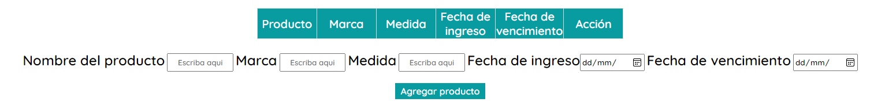

## Este es un ejercicio de las sesiones de html, javascript y css aplicandolo al proyecto que estamos realizando

### Funcionamiento
#### Asi es como se vera al principio, debido a que no hemos ingresado datos

Para que luego se ingrese la informacion que ira en nuestra tabla!

Donde tendremos las opciones de editar y eliminar registros para completar nuestro CRUD con HTML, CSS y JS
# ejercicios

